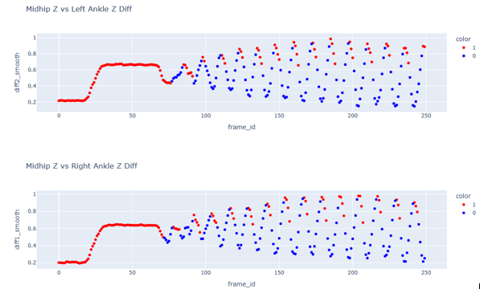
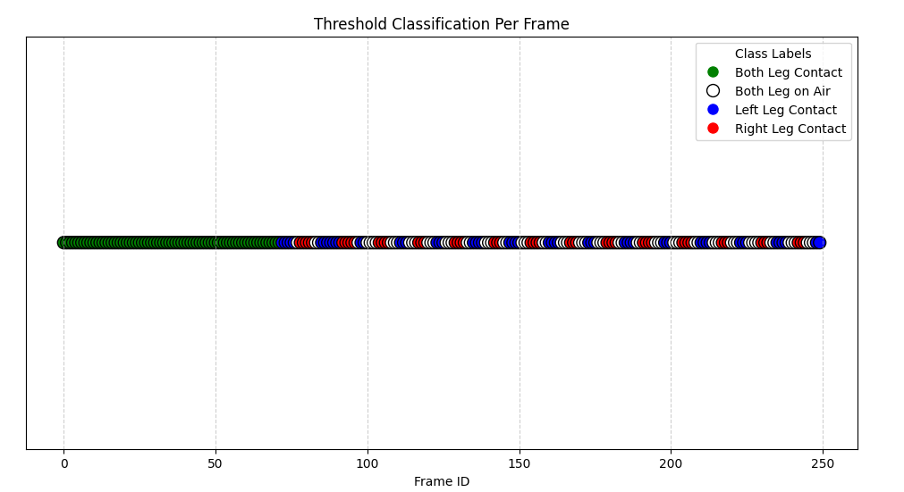
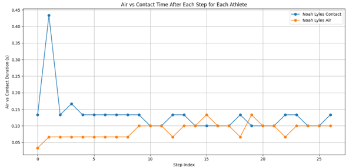
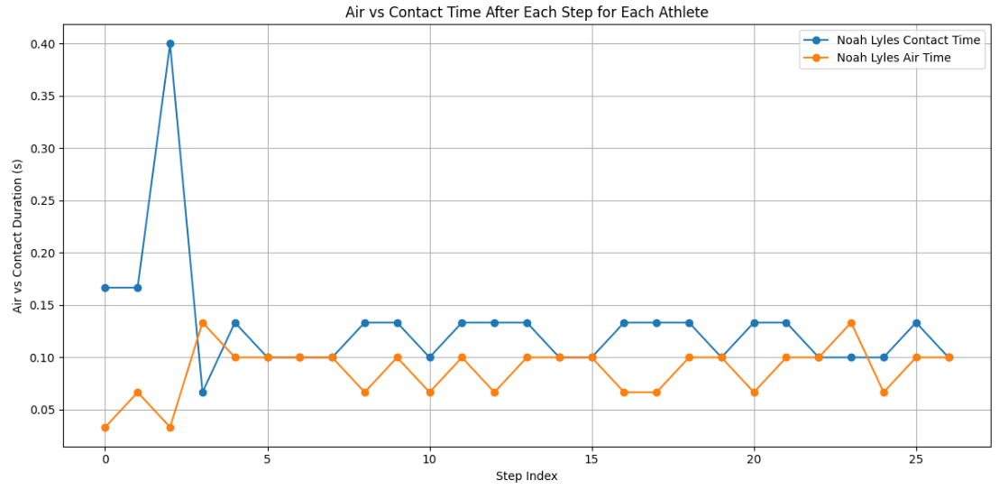
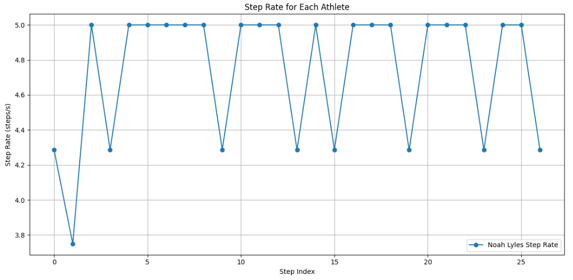
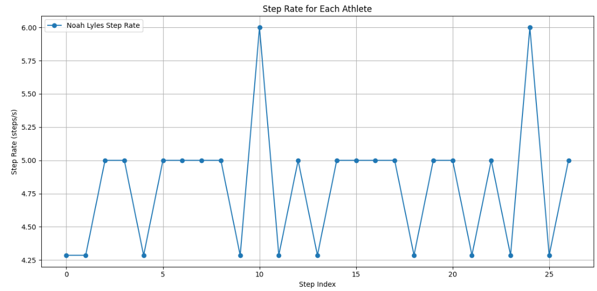
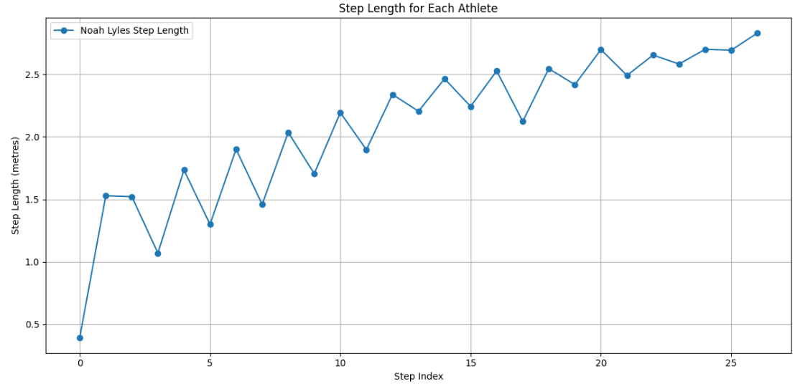
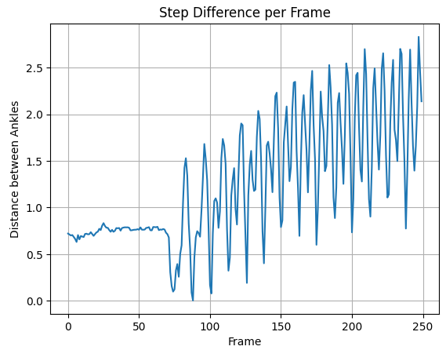
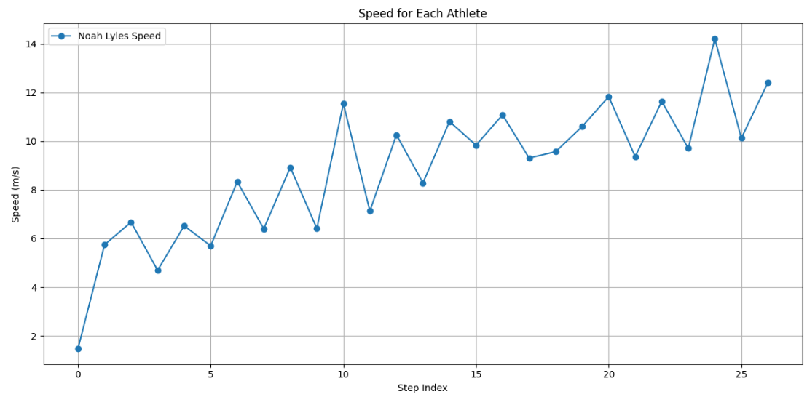

# 100m Sprint Analysis – Paris 2024 Olympics

This project analyzes elite sprinters from the **Paris 2024 Olympic 100m Final** using cutting edge video based biomechanics. With just a video of the race, we extract 3D skeleton data and calculate detailed performance metrics for each athlete, no sensors or wearables needed.
We start with a high quality race video and use AI powered pose estimation tools (like MediaPipe) to track the movement of each athlete. These tools detect key joints (like shoulders, hips, knees, and ankles) in every video frame and generate 3D skeleton data, a simplified stick figure version of the athlete’s motion.

---

## Overview

This project breaks down how sprinters move by analyzing their leg movements step by step. Here's what it does:
- Tracks Leg Movement: Measures how far each ankle moves away from the hip (along the vertical Z-axis) to find when the leg is fully extended during a stride.
- Detects Ground Contact vs. Air Time: Figures out when each leg is touching the ground and when it’s in the air, using a smart rule based method.
- Calculates Key Metrics: Calculates important performance numbers like step length, step frequency (how fast they step), air time, and speed.
- Compares Multiple Athletes: Runs this analysis on 8 different Olympic sprinters to compare their running styles and efficiency.

This approach helps us understand sprinting not just by watching video but by turning it into real, measurable science.

---

## Methodology

### 1. Pose Data Preprocessing
Before we can analyze how an athlete moves, we need to clean and prepare the data that describes their body positions.
- Input: We start with a .csv file that contains the 3D coordinates (X, Y, Z) for 33 body landmarks (like shoulders, hips, knees, ankles, etc.) for every frame of the video. This data is usually generated from pose estimation tools like MediaPipe.
- Filling in Gaps: Sometimes, the pose detection model misses a joint in a few frames, which leaves behind missing data. We fix this by using linear interpolation—essentially guessing what the missing values would be by connecting the dots smoothly between the known values.
- Removing Outliers: If a body point suddenly jumps to an unrealistic position (like a knee flipping across the screen), we identify and correct that using a filtering technique. This keeps the data smooth and realistic across all frames.
This preprocessing step ensures that the skeleton data is clean, continuous, and reliable for accurate analysis in the next stages.

### 2. Smoothing & Peak Detection
After cleaning the pose data, we analyze how each leg moves vertically by comparing the hip and ankle positions. This helps us understand when a foot is about to make contact with the ground.

#### Step by Step Explanation:
- For every frame, we calculate two values:
    - diff1 = |midhip_z - right_ankle_z| → This shows how far the right ankle is from the hips (vertically).
    - diff2 = |midhip_z - left_ankle_z| → Same, but for the left ankle.
These values go up and down as the leg moves during running, high when the foot is in contact and low when it is in air.

#### Smoothing the Signals:
Real world data can be noisy. To remove random spikes and smooth the motion, we apply a Savitzky–Golay filter.
This filter helps us keep the important shape of the movement while getting rid of jittery points.

#### Detecting When a Foot Hits the Ground:
Once the signals are smoothed, we look for peaks—points where the ankle is moving downward and is close to full extension.
If a peak is high enough (above a certain threshold), it likely marks the moment the foot is about to make contact with the ground.
These peaks are labeled as the start of the contact phase for that leg.
This process lets us identify when each leg touches down in the race, using only joint distance and smart signal analysis.

### 3. Analysis of Contact vs. Air
Once we've identified when each leg starts to make contact with the ground, we can now determine whether the athlete is in the contact phase or airborne phase during each moment of the run.

- How It Works:
After we detect a peak (the moment a leg begins to reach down), we assume the leg stays in contact with the ground for a short period until the movement drops below a set threshold.
This entire window, from peak to drop is considered the Contact Phase for that leg.
When neither leg is in contact (both legs are moving upward in the air), the athlete is in the Air Phase.

- Classification Rules for Each Frame:
 Both legs = 0 → The athlete is in the air (no ground contact).
 One leg = 1 → The athlete is in single-leg contact (one foot on the ground).
 Both legs = 1 → The athlete has both legs on ground. This usually happens at the start of the race, when both feet push off the blocks.

- Why This Matters:
Breaking the stride into these phases helps us understand how much time the athlete spends on the ground versus in the air. Elite sprinters often have:
A decreasing contact time (fast and explosive steps)
An increasing air time (efficient stride and lift)
Very brief or no double leg contact (except at the start)

This phase analysis is the foundation for calculating advanced metrics like step duration, stride rhythm, and contact efficiency.

### 4. Metric Computation
Once we know when each foot is in contact or in the air, we can calculate powerful metrics that describe the athlete’s running performance.

#### Key Metrics Explained
- Step Length
Measures how far the athlete travels in a single step.
    - We calculate this by finding the maximum distance between the two ankles during each air phase when both feet are off the ground.

- Step Rate (Frequency)
Measures how quickly the athlete steps.
    - This is calculated as the time between alternate foot contacts for example, from when the left foot lands to when the right foot lands next.
    - Step rate is measured in steps per second (Hz).

- Air Time & Ground Contact Time
Measures how long each foot spends in the air and on the ground.
    - We count the number of frames spent in each phase and convert it to seconds using the video frame rate (FPS).
    - This gives us precise air and contact durations for every stride.

- Speed
Measures how fast the athlete is running.
  - Calculated by multiplying step length by step rate:
**Speed = Step Length × Step Rate**
   - This gives speed in meters per second (m/s) for each stride.

---

## Athletes Analyzed

1. Noah Lyles  
2. Kishane Thompson  
3. Fred Kerley  
4. Akani Simbine  
5. Marcell Jacobs  
6. Letsile Tebogo  
7. Kenny Bednarek  
8. Oblique Seville

---

## Evaluation Metrics (Threshold Analysis Accuracy)

| Athlete             | Accuracy L | Accuracy R | Precision L | Precision R | Recall L | Recall R |
|---------------------|------------|------------|-------------|-------------|----------|----------|
| Noah Lyles          | 94.0       | 95.2       | 93.70       | 95.97       | 94.44    | 94.44    |
| Kishane Thompson    | 94.8       | 93.6       | 95.20       | 92.13       | 94.44    | 95.12    |
| Fred Kerley         | 94.8       | 94.0       | 93.65       | 94.21       | 95.93    | 93.44    |
| Akani Simbine       | 94.0       | 96.0       | 91.60       | 96.75       | 96.77    | 95.20    |
| Marcell Jacobs      | 92.4       | 94.0       | 92.97       | 91.47       | 92.25    | 96.72    |
| Letsile Tebogo      | 94.0       | 96.8       | 96.67       | 95.08       | 91.34    | 98.31    |
| Kenny Bednarek      | 96.0       | 92.8       | 96.85       | 92.13       | 95.35    | 93.60    |
| Oblique Seville     | 91.2       | 94.0       | 91.41       | 92.25       | 91.41    | 95.97    |

---

## Athlete Performance Summary

| Athlete           | Step Length (m) | Contact Time (s) | Air Time (s) | Step Frequency (Hz) |
|-------------------|------------------|-------------------|---------------|----------------------|
| Noah Lyles        | 2.083           | 0.130             | 0.088         | 4.810                |
| Kishane Thompson  | 2.034           | 0.126             | 0.081         | 4.851                |
| Fred Kerley       | 2.521           | 0.133             | 0.094         | 4.815                |
| Akani Simbine     | 2.161           | 0.133             | 0.079         | 5.936                |
| Marcell Jacobs    | 2.126           | 0.120             | 0.092         | 4.790                |
| Letsile Tebogo    | 2.184           | 0.120             | 0.098         | 4.654                |
| Kenny Bednarek    | 2.273           | 0.130             | 0.080         | 4.825                |
| Oblique Seville   | 1.825           | 0.130             | 0.074         | 5.291                |

---

## Visual Outputs

## Classified Thresholds Visualization

## Frame-by-Frame Threshold Classification

## Air vs Contact Duration - Actual

## Air vs Contact Duration - Predicted

## Step Rate - Actual

## Step Rate - Predicted

## Step Length Over Time

## Step Difference per Frame

## Speed Over Time

---

## How to use the code

Follow these simple steps to run the analysis:

- Import the Required Libraries
Make sure all necessary Python libraries (like pandas, numpy, matplotlib, plotly, etc.) are imported at the top of your script or notebook.

- Use the Custom Class
The main functionality is handled by a class called SkeletonAnalyzerFineTune1.
To use it:

- Create an instance of the class by passing in your pose data file.
Call each method step by step to preprocess, analyze, visualize, and extract metrics.
Example:
analyzer = SkeletonAnalyzerFineTune1("your_pose_data.csv")
analyzer.load_and_standardize()
analyzer.rotate_coordinates()
analyzer.compute_differences()
...

### Note on Thresholds
> **Note:**  
> The threshold values used for detecting contact and air phases are sensitive to the scale of the video.  
> If your camera is positioned closer or farther from the athlete compared to the original footage,  
> you may need to **chnange the thresholds** accordingly to get accurate results.  
> For example, a close-up video may produce larger leg extension values than a wide-angle shot.

- View Outputs and Visualizations
The code will produce visual plots, accuracy results, and step by step performance metrics for each athlete.

---

## Dependencies

- `numpy`, `pandas`, `scipy`, `matplotlib`, `plotly`, `cv2`
- `scipy.signal.savgol_filter`
- Custom analysis class: `SkeletonAnalyzerFineTune1`

---

